# 🚀 AWS Cloud Automation Lab (Free Tier Friendly)

> Laboratorio integral para practicar IaC, CI/CD, DevOps, GitOps, automatización y contenedores usando **AWS Free Tier**, **GitHub Actions** y **Jenkins**, todo orquestado en un **DevContainer reproducible**.

---

## Tabla de Contenidos

1. [Arquitectura y Stack](#arquitectura-y-stack)
2. [Estructura del Proyecto](#estructura-del-proyecto)
3. [Diagrama de Flujo](#diagrama-de-flujo)
4. [Pre-requisitos](#pre-requisitos)
5. [Guía Paso a Paso](#guía-paso-a-paso)
6. [Stack y Componentes Detallados](#stack-y-componentes-detallados)
7. [Tips, Seguridad y Buenas Prácticas](#tips-seguridad-y-buenas-prácticas)
8. [Referencias y Recursos](#referencias-y-recursos)

---

## Arquitectura y Stack

**Infraestructura como código:**
- **Terraform:**  
    - EC2 (t2.micro) Ubuntu Server para despliegue y pruebas (Free Tier)
    - S3 bucket para almacenar assets (Free Tier)
    - ECR (Elastic Container Registry) para imágenes de Docker (Free Tier, limitado)
    - IAM usuario/roles mínimos para automatización

**Apps de ejemplo:**
- **Go API RESTful** (`go-api/`)
- **Python Worker** (`py-worker/`)
- Ambos dockerizados y preparados para despliegue automatizado

**CI/CD y Automatización:**
- **GitHub Actions**  
    - Build, test, push a ECR  
    - Despliegue remoto vía SSH y Docker Compose
- **Jenkins (en DevContainer)**  
    - Pipeline alternativo con despliegue completo

**Automatización adicional:**
- **Ansible:** Configuración automática del entorno EC2

**Entorno de desarrollo portátil:**
- **DevContainer:**  
    - Incluye todas las herramientas: Terraform, AWS CLI, Ansible, Go, Python, Docker, Jenkins, etc.

---

## Estructura del Proyecto

```plaintext
aws-cloud-automation-lab/
│
├── .devcontainer/
│   ├── Dockerfile
│   ├── devcontainer.json
│   └── post_create.sh
│
├── terraform/
│   ├── main.tf
│   ├── variables.tf
│   └── outputs.tf
│
├── go-api/
│   ├── main.go
│   └── Dockerfile
│
├── py-worker/
│   ├── worker.py
│   └── Dockerfile
│
├── ansible/
│   └── install_tools.yml
│
├── lab/
│   └── jenkins/
│        └── Jenkinsfile
│
├── scripts/
│   ├── deploy_compose.sh
│   └── destroy_all.sh
│
├── .github/
│   └── workflows/
│        └── ci-cd.yaml
│
└── README.md
```

---

## Diagrama de Flujo

```mermaid
flowchart TD
    subgraph Local_Dev [DevContainer]
      A1[Terraform: Provisiona AWS]
      A2[Ansible: Configura EC2]
      A3[Desarrolla y dockeriza Go/Python]
      A4[Push código a GitHub]
      A5[Jenkins corre pipeline alternativo]
    end

    B1[GitHub Actions: Build, Test, Push ECR]
    B2[Despliegue EC2 por SSH]
    B3[Docker Compose en EC2]

    C1[AWS EC2: Host de Apps]
    C2[S3: Assets]
    C3[ECR: Imágenes Docker]

    A1 --> C1
    A2 --> C1
    A3 --> A4
    A4 --> B1
    B1 --> C3
    B1 --> B2
    B2 --> C1
    A5 --> C3
    A5 --> C1

    C1 --> B3
    B3 --> C1
    C1 -.-> C2
```



---

## Pre-requisitos

- Cuenta AWS con Free Tier activa: [Crear cuenta](https://aws.amazon.com/free/)
- Docker
- Visual Studio Code
- Extensión Dev Containers
- Terraform (instalado en el DevContainer)
- Ansible (instalado en el DevContainer)
- Git (instalado en el DevContainer)
- Llave SSH para EC2:

```bash
ssh-keygen -t rsa -b 4096 -f ~/.ssh/lab-key
```

- Configura tu perfil AWS localmente (y/o monta ~/.aws en el DevContainer):

```bash
aws configure
```

- Jenkins (ya incluido en el DevContainer)

---

## Guía Paso a Paso

### 1. Clonar y abrir el DevContainer

```bash
git clone https://github.com/tu-usuario/aws-cloud-automation-lab.git
cd aws-cloud-automation-lab
# Abre en VSCode y selecciona: "Reopen in Container"
```

Al iniciar, el entorno tendrá Terraform, Ansible, Go, Python, Docker, Jenkins y demás herramientas listas para usar.

---

### 2. Provisionar infraestructura en AWS

```bash
cd terraform
terraform init
terraform apply
# Confirma recursos y espera la salida:
# - IP pública EC2
# - Repositorios ECR
# - Bucket S3
```

Usa la variable `public_key_path` para pasar tu key SSH (por defecto `~/.ssh/lab-key.pub`).

---

### 3. Preparar la EC2 con Ansible

```bash
# Desde el contenedor
ansible-playbook -i "<EC2_PUBLIC_IP>," -u ubuntu --key-file ~/.ssh/lab-key ../ansible/install_tools.yml
```

Esto instala Docker, docker-compose y herramientas básicas en la EC2.

---

### 4. Build y Push de Apps (Go/Python) a ECR

**Go API**

```bash
cd go-api
docker build -t go-api:latest .
```

**Python Worker**

```bash
cd py-worker
docker build -t py-worker:latest .
```

**Login y Push a ECR**

```bash
aws ecr get-login-password --region us-east-1 | \
docker login --username AWS --password-stdin <TU-ID>.dkr.ecr.us-east-1.amazonaws.com

docker tag go-api:latest <TU-ID>.dkr.ecr.us-east-1.amazonaws.com/go-api:latest
docker push <TU-ID>.dkr.ecr.us-east-1.amazonaws.com/go-api:latest

docker tag py-worker:latest <TU-ID>.dkr.ecr.us-east-1.amazonaws.com/py-worker:latest
docker push <TU-ID>.dkr.ecr.us-east-1.amazonaws.com/py-worker:latest
```

---

### 5. Desplegar en EC2 con Docker Compose

Copia el archivo `deploy_compose.sh` al home de la EC2:

```bash
scp -i ~/.ssh/lab-key scripts/deploy_compose.sh ubuntu@<EC2_PUBLIC_IP>:~
ssh -i ~/.ssh/lab-key ubuntu@<EC2_PUBLIC_IP>
bash deploy_compose.sh
docker-compose -f ~/deploy/docker-compose.yml up -d
```

Verifica los contenedores corriendo:

```bash
docker ps
curl http://localhost:8080/ping # en EC2
```

---

### 6. Automatización CI/CD con GitHub Actions

`.github/workflows/ci-cd.yaml` ya está configurado para:

- Build de imágenes
- Push a ECR
- Despliegue remoto por SSH a EC2

Requiere Secrets en el repo:

- `AWS_ACCESS_KEY_ID`, `AWS_SECRET_ACCESS_KEY`
- `EC2_PUBLIC_IP`, `EC2_SSH_KEY` (key privada en base64), `ECR_REGISTRY`

Haz push a main/master para probar el pipeline completo.

---

### 7. Jenkins: CI/CD alternativo y laboratorio

Jenkins está preinstalado en el DevContainer:

- UI: [http://localhost:8081](http://localhost:8081)

Clave inicial:

```bash
sudo cat /var/lib/jenkins/secrets/initialAdminPassword
```

Instala plugins recomendados (primera vez).

Agrega credenciales:

- AWS: usuario IAM con acceso a ECR
- SSH Key: para EC2 (tipo "SSH Username with private key")
- Global var: EC2_IP

Pipeline de ejemplo:  
`lab/jenkins/Jenkinsfile`  
Hace build, push a ECR y despliega igual que GitHub Actions.

---

## Stack y Componentes Detallados

### Infraestructura (Terraform)

- Provisona EC2, S3, ECR, IAM

### AWS EC2

- Ubuntu 22.04 LTS, t2.micro (Free Tier)

### AWS S3 / AWS ECR

### Apps

- Go: API REST sencilla (Gin)
- Python: Worker de ejemplo
- Docker: Contenerización de apps

### Automatización y CI/CD

- GitHub Actions: Automatización nativa
- Jenkins: Orquestador alternativo (corre en DevContainer)
- Ansible: Provisionamiento y config de EC2

### DevContainer

- Dev Containers VSCode: Portabilidad y reproducibilidad

---

## Tips, Seguridad y Buenas Prácticas

- Destruye todo al terminar

```bash
cd terraform
terraform destroy
```

- Borra imágenes, repos y buckets innecesarios
- Usa IAM de menor privilegio
- Evita subir claves privadas o secrets a git
- Anota los recursos y monitorea consumo en AWS Console
- Actualiza tus herramientas regularmente
- Lee logs de Jenkins y GitHub Actions para debugging

---

## Referencias y Recursos

- [Terraform Getting Started](https://learn.hashicorp.com/terraform)
- [AWS Free Tier](https://aws.amazon.com/free/)
- [ECR Push Guide](https://docs.aws.amazon.com/AmazonECR/latest/userguide/docker-push-ecr-image.html)
- [Jenkins Declarative Pipeline Docs](https://www.jenkins.io/doc/book/pipeline/syntax/)
- [DevContainers Doc](https://containers.dev/)
- [Ansible Quickstart](https://docs.ansible.com/ansible/latest/docs/playbooks/quickstart_guide/index.html)